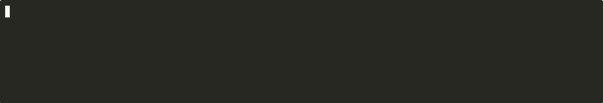

<div align="center">

# codachi

**A productivity copilot disguised as a tamagotchi, living in your [Claude Code](https://docs.anthropic.com/en/docs/claude-code) statusline.**

[](https://github.com/vincent-k2026/codachi/actions/workflows/ci.yml)




</div>

## Why codachi?

- **Context ETA** — `~15m left` tells you *when* to `/compact`, not just how full you are. The only statusline that predicts it.
- **Event-aware pet** — hooks watch Claude work and react with 850+ contextual messages, across 40+ event categories.
- **`codachi stats`** — local, zero-telemetry productivity dashboard: sessions, uptime, tier progress, last-24h test/commit/edit counts.
- **Plugin API** — drop a `.mjs` file into `~/.config/codachi/plugins/` to add your own palettes and messages. No forking required.
- **i18n** — bundled 简体中文; English fallback for any missing keys. BYO locale via `CODACHI_LOCALE`.
- **Terminal-aware** — auto-detects truecolor / 256-color / 16-color / monochrome and degrades gracefully. `NO_COLOR` honored.
- **Zero overhead** — no API calls, no tokens consumed. Local JSON + disk. Render p95 is ~0.1ms (verified by `npm run bench`).

---

## Quick Start

One line. That's it.

```bash
npx codachi init
```

This wires up your `~/.claude/settings.json` statusline and PostToolExecution hook. Restart Claude Code and your pet will hatch.

Prefer a global install? `npm install -g codachi && codachi init` works too.

**Useful commands once installed:**

```bash
npx codachi stats             # productivity dashboard (sessions, uptime, tiers)
npx codachi plugins           # list loaded plugins
npx codachi config            # interactive TUI configurator
npx codachi demo              # live preview without installing
```

<details>
<summary>From source (if you want to hack on it)</summary>

```bash
git clone https://github.com/vincent-k2026/codachi.git
cd codachi && npm install && npm run build
node dist/index.js init
```

</details>

<details>
<summary>Manual setup (without init command)</summary>

Add to `~/.claude/settings.json`:

```json
{
  "statusLine": {
    "type": "command",
    "command": "node /absolute/path/to/codachi/dist/index.js"
  },
  "hooks": {
    "PostToolExecution": [
      {
        "matcher": "",
        "command": "node /absolute/path/to/codachi/dist/hook.js"
      }
    ]
  }
}
```

</details>

---

## Statusline Layout

```
Line 1   [Opus 4.6] [======----] 55% 555K/1.0M ^3%/m ~15m | 5h [==----] 32% ~2h | 7d [-----] 8% ~6d
Line 2   git:(main*) ~12 ?3 | +489 -84 lines | last: fix auth bug
Line 3   Mochi *slow blink* ...I love you | myapp [Node] | up 45m
```

| Metric | Description |
|:-------|:------------|
| `[======----] 55%` | Context window usage with progress bar |
| `555K/1M` | Tokens used / total window size |
| `^3%/m` | Context burn speed (how fast you're filling up) |
| `~15m` | Estimated time until context is full |
| `5h [==----] 32% ~2h` | 5-hour rate limit usage + reset countdown |
| `7d [-----] 8% ~6d` | 7-day rate limit usage + reset countdown |
| `git:(main*) ~12 ?3` | Branch, modified/untracked files |
| `+489 -84 lines` | Insertions / deletions in working tree |
| `Mochi *slow blink*` | Custom pet name + contextual mood message |
| `myapp [Node]` | Project name + detected language |
| `up 45m` | Session uptime |

---

## Features

### Your pet grows with context

The more context you use, the bigger your pet gets.

```
/\_____/\  ~            tiny    (< 20%)
( o w o )
( "   " )

/\_____________/\  ~     medium  (40-60%)
==( o   w   o )==
==( "       " )==

/\_________________________/\  ~     thicc   (> 80%)
====( o       w       o )====
====( "               " )====
```

### 5 species, 5 moods, 10 palettes

Each session randomly assigns a species and color palette (or set them in config).

```
/\_____/\  ~       (ovo)        {O,O}        ,---.        (\  /)
( o w o )         <(   )>      /)--(\\      ( O.O )      ( oYo )
( "   " )          (" ")        " "        /|~|~|\\       (")(")
   Cat            Penguin        Owl       Octopus        Bunny
```

| Mood | Trigger | Expression |
|:-----|:--------|:-----------|
| **Idle** | Normal | `o` `^` `-` blink cycle, `~` tail wag |
| **Happy** | Tests pass, commit, recovery | `^` squinting eyes |
| **Busy** | Claude streaming | Rapid eye cycle |
| **Danger** | Context > 85% | `O` wide eyes, `!` tail |
| **Sleep** | Context < 10% | `-` closed eyes, `z` `Z` tail |

**Palettes:** Coral Flame · Electric Blue · Neon Mint · Purple Haze · Hot Pink · Golden Sun · Ice Violet · Cherry Blossom · Cyan Surge · Tangerine

### Event-reactive mood (850+ messages)

Via the PostToolExecution hook, your pet knows what Claude is doing and reacts in real time.

| Event | Example message |
|:------|:----------------|
| Tests pass | *"ALL GREEN! \*happy dance\*"* |
| Tests fail | *"Tests tripped... you got this!"* |
| Build succeeds | *"Clean build! \*sparkling eyes\*"* |
| Git commit | *"Checkpoint saved! \*relief\*"* |
| Git push | *"Go forth, little commits!"* |
| Fix after failure | *"Redemption arc complete!"* |
| Multiple failures | *"Hang in there! \*warm hug\*"* |
| Rapid editing | *"Flow state detected! Beautiful~"* |
| Dangerous commands | *"My insurance doesn't cover this..."* |
| Cat idle | *"\*knocks something off the desk\*"* |
| Owl idle | *"In my expert owl-pinion, this is going well"* |
| Octopus idle | *"\*squirts ink\* Oops, that was the dark theme"* |
| Late night | *"The whole world is asleep... except us"* |
| Easter egg | *"I live in the statusline but you live in my heart"* |

Messages are file-aware (shows the actual filename being edited), time-aware (morning/night/weekend), and relationship-aware (different messages for strangers vs besties).

<details>
<summary>All 30+ event categories</summary>

Testing (pass/fail) · Building (pass/fail) · Installing packages · Git (commit, push, pull, merge, rebase, stash, checkout) · Linting/formatting · Server start · Docker/K8s · Network/HTTP · Dangerous commands · Search/grep · File editing by type (tests, docs, styles, config, code) · New file creation · Rapid editing · Code exploration · Recovery from errors · Struggling pattern (3+ failures) · Session milestones · Tier upgrades · Smart `/compact` suggestion

</details>

<details>
<summary>Supported file type reactions</summary>

TypeScript · JavaScript · Python · Rust · Go · Ruby · Java · Kotlin · Swift · C/C++ · CSS · HTML · Vue · Svelte · Shell · SQL · Proto · GraphQL · Config · Docs · Tests

</details>

### Pet memory

Your pet remembers you across sessions and levels up your relationship.

| Tier | After | Greeting |
|:-----|:------|:---------|
| Stranger | 0 sessions | *"Oh! A new friend!"* |
| Acquaintance | 3 sessions | *"Hey, good to see you again!"* |
| Friend | 15 sessions | *"My favorite human is back!"* |
| Bestie | 50 sessions | *"BESTIE! You're here! #50"* |

Tier upgrades trigger a one-time celebration: *"BESTIE STATUS UNLOCKED! WE DID IT!"*

### Smart `/compact` suggestion

When context is above 70% and burn speed is high, your pet gently suggests compacting — once per trigger, never nagging.

> *"Cache is getting cold... maybe /compact?"*

---

## Productivity dashboard

Run `codachi stats` any time for a local summary of your relationship with your pet — no network calls, no telemetry, everything read from `~/.claude/plugins/codachi/`.

```
codachi stats — Mochi the cat

  first met    2026-01-12  (87d ago)
  last seen    2026-04-09
  sessions     73
  total uptime 4d12h
  avg session  89m

  relationship
  current      friend
  progress     ████████████████░░░░  80%
  next tier    bestie (23 more sessions)

  recent activity (last 24h from local events)
  events       142
  tests        18 pass · 3 fail
  commits      7
  edits        34

  this session 1h12m
```

---

## Plugins

Drop an ES module into `~/.config/codachi/plugins/` to add custom palettes and message packs. Plugins are auto-loaded at startup — no registration, no imports in user code.

```js
// ~/.config/codachi/plugins/midnight.mjs
export default {
  name: 'midnight',
  messages: {
    BUSY_MESSAGES: ['⌘ focused', '⌘ flow state'],
    EVENT_MESSAGES: {
      test_passed: ['green — ship it', '✓ all green'],
    },
  },
  palettes: [
    {
      name: 'Midnight',
      body:   [20, 30, 80],
      accent: [60, 80, 160],
      face:   [180, 190, 230],
      blush:  [120, 140, 200],
    },
  ],
};
```

Run `codachi plugins` to see what's loaded. Precedence is: **locale file > plugin > English default**, so translators still have the final word.

**Available message keys:** `BUSY_MESSAGES`, `DANGER_MESSAGES`, `USAGE_HIGH_MESSAGES`, `VELOCITY_FAST`, `VELOCITY_SLOW`, `COMPACT_SUGGEST`, `IDLE_MESSAGES` (per animal), `SIZE_MESSAGES` (per body size), `WELCOME_MESSAGES` (per tier), `TIER_UPGRADE` (per tier), `RARE_EVENTS`, `EVENT_MESSAGES` (per category), `FILE_TYPE_MESSAGES` (per language), `GIT_CLEAN_MESSAGES` / `GIT_BUSY_MESSAGES` / `GIT_AHEAD_MESSAGES` / `GIT_BEHIND_MESSAGES` / `GIT_STASH_MESSAGES` / `GIT_WIP_MESSAGES`.

---

## Localization

Codachi ships with English (canonical source) and Simplified Chinese. Override any or all message keys with your own language:

```bash
CODACHI_LOCALE=zh   # or set LANG / LC_ALL on your OS
```

User overrides go in `~/.config/codachi/locales/<locale>.json` — same key schema as plugins, partial files are fine (missing keys fall through to English). To contribute a language upstream, open a PR adding `src/locales/<locale>.json`.

---

## Configuration

Run the interactive wizard:

```bash
node dist/index.js config
```

Or edit `~/.config/codachi/config.json` directly:

```json
{
  "name": "Mochi",
  "animal": "cat",
  "palette": 3,
  "widgets": ["model", "context", "velocity", "rateLimit5h", "rateLimit7d"]
}
```

| Option | Default | Description |
|:-------|:--------|:------------|
| `name` | species name | Custom pet name (e.g. "Mochi") |
| `animal` | random | `cat` `penguin` `owl` `octopus` `bunny` |
| `palette` | random | Color palette index `0`–`9` |
| `widgets` | all shown | Line 1 widget order + visibility — see widgets below |
| `showTokens` | `true` | Show token count `555K/1M` |
| `showVelocity` | `true` | Show burn speed `^3%/m` + time remaining `~15m` |
| `showGit` | `true` | Show git status on line 2 |
| `showUptime` | `true` | Show session uptime |
| `animationSpeed` | `1.5` | Seconds per animation frame |

**Available widgets** (line 1): `model`, `context`, `velocity`, `rateLimit5h`, `rateLimit7d`. Reorder or remove any of them in the `widgets` array.

**Environment variables:**

| Var | Purpose |
|:----|:--------|
| `CODACHI_LOCALE` | Force a locale (`en`, `zh`, etc.) — overrides `LANG` |
| `CODACHI_COLOR` | Force color depth: `truecolor` \| `256` \| `16` \| `none` |
| `CODACHI_NO_PLUGINS` | Set to `1` to skip plugin scanning |
| `CODACHI_QUIET` | Set to `1` to silence `codachi.log` writes |
| `CODACHI_DEBUG` | Set to `1` to enable verbose debug logs |
| `NO_COLOR` | Standard no-color opt-out (honored) |
| `FORCE_COLOR` | Standard color force: `0`–`3` (honored) |

**Debug log**: errors land in `~/.claude/plugins/codachi/codachi.log` (auto-rotated at 256KB). `tail -f` it if things look off.

---

## How it works

```
Claude Code ──stdin:JSON──▶ codachi ──stdout:ANSI──▶ statusline
                 │
                 └──hook──▶ events.json ──▶ mood engine
```

| Property | Detail |
|:---------|:-------|
| **Cost** | Zero — hooks write to disk, no API calls, no tokens |
| **Speed** | ~50ms render, git cached for 2s |
| **Persistence** | Session state, memory, events in `~/.claude/plugins/codachi/` |
| **Reliability** | Atomic writes (write-to-tmp + rename), graceful degradation |
| **Session binding** | Pet identity tied to `transcript_path` from Claude Code |
| **Event freshness** | Hot (< 15s), warm (< 60s), cold (< 5m) — priority decays over time |
| **Pattern detection** | Struggling (3+ failures), recovery (fail → success), rapid editing (5+ in 60s) |

<details>
<summary>Project structure</summary>

```
src/
├── index.ts           # Entry point + init/demo routing
├── init.ts            # One-command install (codachi init)
├── demo.ts            # Live terminal demo
├── hook.ts            # Claude Code PostToolExecution hook
├── events.ts          # Event classifier (40 categories)
├── mood.ts            # Mood engine (15-tier priority)
├── messages/          # 850+ messages split by category
│   ├── events.ts      #   Event-reactive messages
│   ├── idle.ts        #   Animal idle + body size messages
│   ├── context.ts     #   Velocity, cache, danger, busy
│   ├── social.ts      #   Welcome, tier upgrade, easter eggs
│   └── git.ts         #   Git status + file type messages
├── stdin.ts           # Parse Claude Code JSON input
├── git.ts             # Git status with 2s caching
├── state.ts           # Session, velocity, memory, tiers
├── config.ts          # User configuration
├── identity.ts        # Animal + palette selection (10 palettes)
├── project.ts         # Language detection (21 markers)
├── fs-utils.ts        # Atomic file writes
├── width.ts           # Terminal char width (CJK-aware)
├── types.ts           # TypeScript types
├── animals/           # 5 species × 5 sizes × 5 moods × 4 frames
└── render/            # 3-line ANSI compositor + truecolor
```

</details>

---

## Development

```bash
npm install
npm run build          # compile TypeScript + copy locales to dist/
npm run dev            # watch mode
npm test               # 370 tests
npm run test:cov       # coverage report (91%+ lines)
npm run bench          # render p50/p95/p99 benchmark (budget: 50ms)
```

**Record a demo GIF:**

```bash
bash scripts/record-gif.sh     # requires asciinema + agg
# or
vhs scripts/demo.tape          # requires vhs
```

---

## Related projects

- [**ccstatusline**](https://github.com/sirmalloc/ccstatusline) — Highly customizable statusline for Claude Code with powerline support, themes, and rich layout options. If codachi's pet is too much personality for your taste, ccstatusline is the polished, configurable alternative.

## License

MIT
