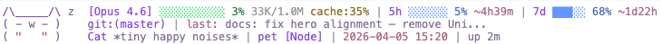

<div align="center">

# codachi

**A tamagotchi that lives in your [Claude Code](https://docs.anthropic.com/en/docs/claude-code) statusline.**

Your pet hatches when you start coding, grows as context fills up,<br>
reacts to your work, and remembers you between sessions.



</div>

---

## Install

```bash
git clone https://github.com/vincent-k2026/codachi.git
cd codachi && npm install && npm run build
```

Add to `~/.claude/settings.json`:

```json
{
  "statusLine": {
    "type": "command",
    "command": "node /absolute/path/to/codachi/dist/index.js"
  },
  "hooks": {
    "PostToolExecution": [
      {
        "matcher": "",
        "command": "node /absolute/path/to/codachi/dist/hook.js"
      }
    ]
  }
}
```

Restart Claude Code. Your pet will hatch.

---

## Your pet grows

The fatter your context, the fatter your pet.

```
/\_____/\  ~            tiny    (~20% context)
( o w o )
( "   " )

/\_________/\  ~         small   (~35%)
=( o  w  o )=
=( "     " )=

/\_____________/\  ~     medium  (~55%)
==( o   w   o )==
==( "       " )==

/\___________________/\  ~     chubby  (~75%)
===( o     w     o )===
===( "           " )===

/\_________________________/\  ~     thicc   (~95%)
====( o       w       o )====
====( "               " )====
```

---

## 5 species

Each session gets a random species and color palette.

```
/\_____/\  ~       (ovo)        {O,O}        ,---.        (\  /)
( o w o )         <(   )>      /)--(\\      ( O.O )      ( oYo )
( "   " )          (" ")        " "        /|~|~|\\       (")(")
   Cat            Penguin        Owl       Octopus        Bunny
```

10 palettes: Coral Flame · Electric Blue · Neon Mint · Purple Haze · Hot Pink · Golden Sun · Ice Violet · Cherry Blossom · Cyan Surge · Tangerine

---

## 4 moods

| State | When | Eyes | Tail |
|:------|:-----|:-----|:-----|
| **Idle** | Normal | `o`  `^`  `-` blink | `~` wag |
| **Busy** | Claude streaming | Rapid cycle | `~` |
| **Danger** | Context > 85% | `O` wide | `!` |
| **Sleep** | Context < 10% | `-` closed | `z` `Z` |

---

## What you see

```
Line 1   [Opus 4.6] [======----] 55% 555K/1.0M ^3%/m cache:78% | 5h [==----] 32% ~2h
Line 2   git:(main*) ~12 ?3 | +489 -84 lines | last: fix auth bug
Line 3   Cat *slow blink* ...I love you | myapp [Node] | up 45m
```

| Metric | What it tells you |
|:-------|:------------------|
| `██████░░░░ 55%` | Context window usage |
| `555K/1M` | Tokens used / window size |
| `^3%/m` | Context burn speed — predict when to `/compact` |
| `cache:80%` | Token cache efficiency — unique to codachi |
| `5h ██░░ 32% ~2h` | Rate limit usage + reset countdown |
| `git:(main*) ~12 ?3` | Branch, modified/untracked files |
| `+489 -84 lines` | Insertions / deletions |
| `Cat *slow blink*` | Pet name + mood message (350+ messages) |
| `myapp [Node]` | Project name + auto-detected language |
| `up 45m` | Session uptime |

---

## Pet memory

Your pet remembers you across sessions.

| Tier | Sessions | Greeting |
|:-----|:---------|:---------|
| Stranger | 0 | *"Oh! A new friend!"* |
| Acquaintance | 3+ | *"Hey, good to see you again!"* |
| Friend | 15+ | *"My favorite human is back!"* |
| Bestie | 50+ | *"BESTIE! You're here! #50"* |

---

## 350+ mood messages

Your pet watches what Claude does and reacts in real time via hooks.

| When | Example |
|:-----|:--------|
| Tests pass | *"ALL GREEN! \*happy dance\*"* |
| Tests fail | *"Tests tripped... you got this!"* |
| Build succeeds | *"Clean build! \*sparkling eyes\*"* |
| Build fails | *"The compiler disagrees... hmm"* |
| Git commit | *"Checkpoint saved! \*relief\*"* |
| Git push | *"Code is flying to the remote!"* |
| Installing packages | *"New dependencies! \*unwraps eagerly\*"* |
| Editing a file | *"Working on auth.ts~ nice!"* |
| Creating new file | *"A new file is born! \*celebrates\*"* |
| Writing tests | *"Testing is caring!"* |
| Writing docs | *"Documentation hero! \*salutes\*"* |
| Editing CSS | *"Making things pretty! \*admires\*"* |
| Linting/formatting | *"Code spa day! Refresh~"* |
| Multiple failures | *"Hang in there! \*warm hug\*"* |
| Fix after failure | *"From failure to victory!"* |
| Rapid editing | *"Flow state detected! Beautiful~"* |
| Exploring code | *"Code archaeology in progress!"* |
| Dangerous commands | *"Living on the edge!"* |
| Docker | *"Container time! \*packs boxes\*"* |
| Fast context burn | *"Whoa, burning through context!"* |
| Good cache hits | *"Cache is cooking! Snappy session~"* |
| Clean repo | *"Everything's tidy~ feels nice"* |
| Easter egg | *"Found a bug! ...it's kinda cute tho"* |
| Cat idle | *"\*slow blink\* ...I love you"* |
| Owl idle | *"Whooo writes great code? You do!"* |

<details>
<summary>All event categories</summary>

Testing · Building · Installing · Git commit/push/pull/merge/rebase/stash/checkout · Linting · Server start · Docker · Network/HTTP · Dangerous commands · Search · File editing by type (tests/docs/styles/config/code) · New file creation · Rapid editing · Code exploration · Recovery from errors · Struggling pattern · Session milestones

</details>

---

## Configuration

Optional. Create `~/.config/codachi/config.json`:

```json
{
  "animal": "cat",
  "palette": 0,
  "animationSpeed": 1.5
}
```

| Option | Default | Values |
|:-------|:--------|:-------|
| `animal` | random | `cat` `penguin` `owl` `octopus` `bunny` |
| `palette` | random | `0`-`9` |
| `showTokens` | `true` | Token count display |
| `showVelocity` | `true` | Context burn speed |
| `showCache` | `true` | Cache hit rate |
| `showGit` | `true` | Git status line |
| `showUptime` | `true` | Session uptime |
| `animationSpeed` | `1.5` | Seconds per frame |

---

## How it works

```
Claude Code ──stdin:JSON──▶ codachi ──stdout:ANSI──▶ statusline
                 │
                 └──hook──▶ events.json ──▶ mood engine
```

- Hooks log tool events (zero tokens, zero API calls)
- Event-reactive moods: hot (< 15s), warm (< 60s), cold (< 5m)
- Pattern detection: struggling, recovery, rapid editing, exploring
- Animation driven by wall clock — correct frame on every refresh
- Git results cached 2 seconds
- Session bound to `transcript_path`

<details>
<summary>Project structure</summary>

```
src/
├── index.ts          # Entry point
├── hook.ts           # Claude Code hook — logs events
├── events.ts         # Event reader + classifier
├── stdin.ts          # Parse Claude Code JSON
├── git.ts            # Git status + file type detection
├── state.ts          # Session, velocity, memory
├── config.ts         # User configuration
├── identity.ts       # Animal + palette selection
├── mood.ts           # 350+ messages, 14-tier priority
├── project.ts        # Language detection
├── width.ts          # Terminal char width
├── types.ts          # TypeScript types
├── animals/          # 5 species × 5 sizes × 4 states × 4 frames
└── render/           # 3-line compositor + truecolor
```

</details>

## License

MIT
